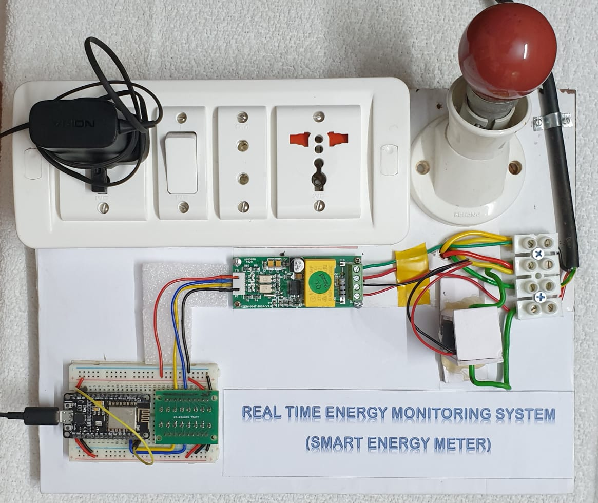

# Real Time Energy Monitoring System using IoT

<h1>Design Project</h1>

A smart energy monitoring system app that enables user to see their live energy consumption details along with the bill  
<h2>HARDWARE</h2>

The hardware comprises of a <b>PZEM-004T module</b>, a <b>Voltage level converter</b>, an <b>ESP8266 NodeMUCU</b> and provisions for providing different <b>Loads</b>. The below figure shows the hardware setup.

 
 

<h3>WORKING</h3>
When the supply is on, the PZEM module starts monitoring the various electrical factors. The NODEMCU is programmed with <b>deep sleep mode</b> and recieves data from the PZEM after every sleep interval.This value is given to <b>Google sheets</b> which acts as the server that stores the sensor data. A <b>google script code</b> is written in the <b>script editor</b> of the sheet to write the sensor value to sheets. A code(also written in the same script editor) is used to send every new data written in sheets to <b>Firebase database</b>. The <b>Firestore</b? database of firebase is used to store the values, which is used as the backend of the <b>Mobile Application</b>.

